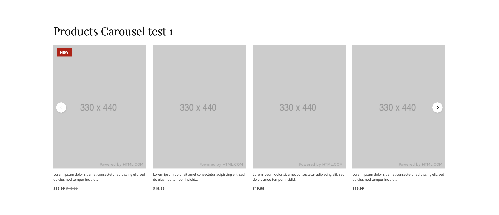
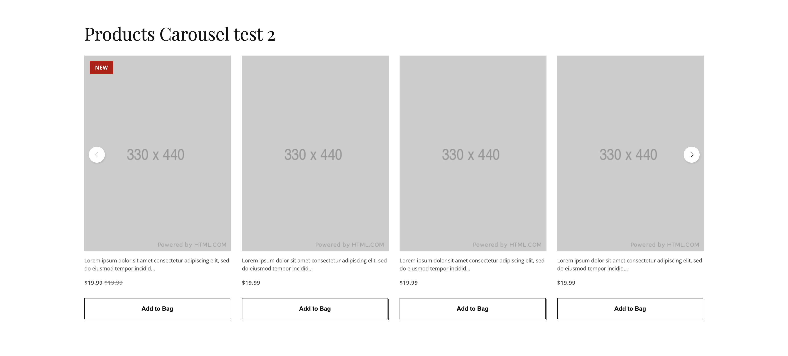
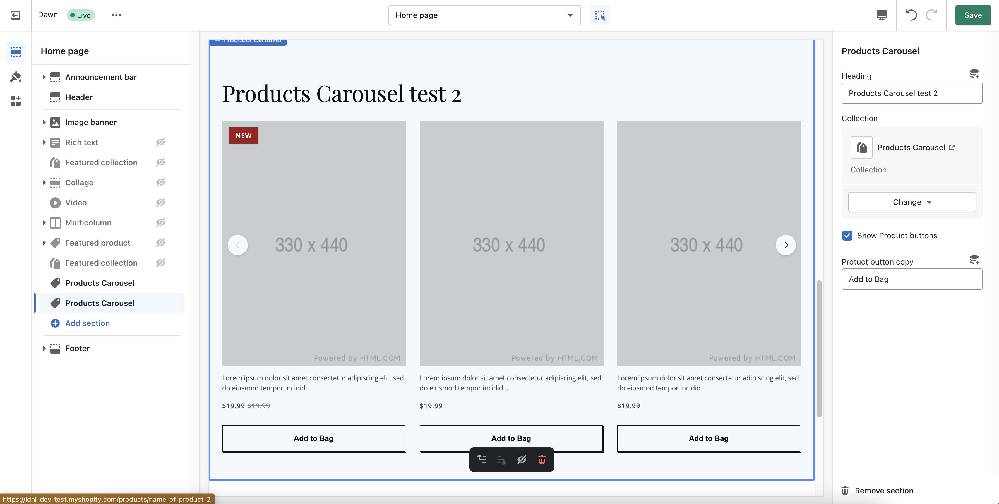

# IDHL/Fostr - Front End Developer Task

This is a documentation to a solution of the Front end Developer assignment.

# Table of contents

- [IDHL/Fostr - Front End Developer Task](#idhlfostr---front-end-developer-task)
- [Table of contents](#table-of-contents)
  - [Shopify preview store](#shopify-preview-store)
  - [Products Carousel functionality](#products-carousel-functionality)
  - [Screenshots](#screenshots)
  - [File Structure](#file-structure)
  - [Continued development](#continued-development)
  - [Author](#author)

## Shopify preview store

**Website URL:** https://idhl-dev-test.myshopify.com/password
**Password:** idhl321

## Products Carousel functionality

-   Products Carousel is setup as a theme section
-   Editable Section Header(if the field is empty it will not display)
-   Products collection selector
-   Responsive
-   Each Product has a Featured Products Image, Product Title, truncated product description, price, compared at price(if that exist), "new" tag(if that exists)
-   Products with 'new' tag will be marked as per design in the carousel.
-   Enable buttons checkbox
-   Add to cart button copy field
-   If Product is not in stock displays sold out and it can't be added to the cart

## Screenshots

**Products Carousel test 1**

**Products Carousel test 2**

**Products Carousel Shopify Admin View**


## File Structure

```
root
│
└───Layout
│   │
│   └─── theme.liquid
│
└───Sections
│   │
│   └─── products-carousel.liquid
│
└───Snippets
│   │
│   └─── products-carousel-card.liquid
│
└───Assets
│   │
│   └─── products-carousel.css
│   └─── products-carousel-card.css
│   └─── products-carousel.js
│
└───Locales
│   │
│   └─── en.default.schema.json
│
```

**theme.liquid**<br>
Added custom google fonts and swiper script/css

**Products-carousel.liquid**<br>
This is a main section file, it pulls in neccessary css/js files and defines schema for the editable fields.

**Products-carousel-card.liquid**<br>
This is a snippet liquid file for the products carousel card.

**products-carousel.css**,<br>
**products-carousel-card.css**,<br>
**products-carousel.js**<br>
Those are all the assets files with custom css and javascript code.

**en.default.schema.json**<br>
This is where all the products carousel shopify admin labels are defined, at the moment there are translations just for the english language.

## Continued development

There are things that could be added to this carousel on top of existing functionality like, there is few thing of the top of my head but there could definitly be more:

-   section padding options
-   optional section description under heading
-   maximum number of products
-   filtering to display "new" products at the beggining of the carousel
-   image ration settigns
-   disabling carousel on desktop if there are 4 or less products
-   expand add to bag functionality if product has variants/options

## Author

-   Website - [Tomasz Posiadala](https://www.tomaszposiadala.com)
-   LinkedIn - [Tomasz Posiadala](https://www.linkedin.com/in/tomasz-posiadala/)
